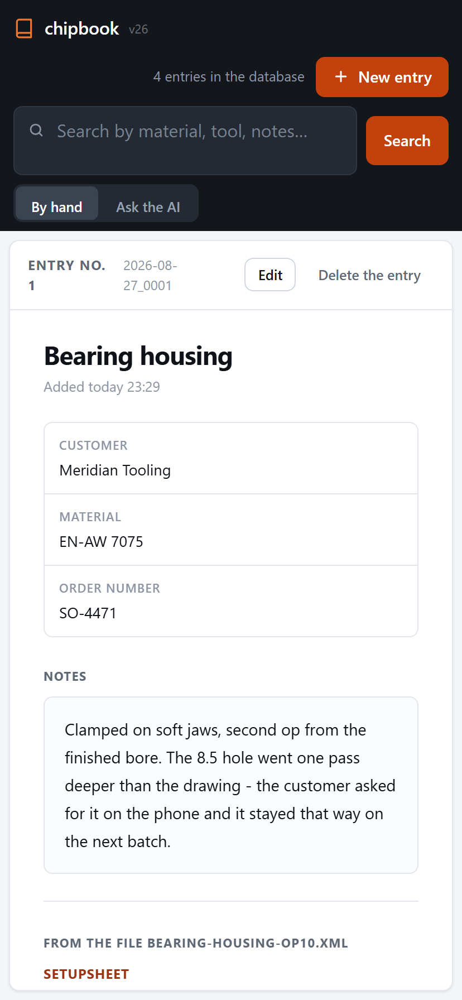

# chipbook

[](https://github.com/remigiuszdabrowski104-png/chipbook/actions/workflows/ci.yml)
[](LICENSE)
[](pyproject.toml)
[](pyproject.toml)
[](tests)

**A local catalogue of CNC jobs. The files stay where the workshop put
them; the catalogue makes them findable again.**

A machinist finishes a part, saves the CAM project, the G-code and the
setup sheet into a folder, and moves on. Three years later somebody asks
for that part again. The folder is still on the drive — under a name that
made sense at the time — and the one thing nobody wrote down is the thing
that mattered: *the drawing said 8.5, we ran it one pass deeper, and the
customer agreed on the phone.*

chipbook is where that sentence goes, next to the files it belongs to.


*Above: a word typed into the search box (`woodruff`) appears in no field
of any entry. It is inside an attached Mastercam setup sheet, which
chipbook has read and indexed. Clicking the hit opens the job with that
sheet broken out into stock, machine, operations and tools.*

**Built for one shop floor, not for a portfolio.** It was written for a
CNC programmer on a Windows laptop, with a phone as a second screen at the
machine. Every awkward decision in here — the fixed port, the typo
threshold, the refusal to let a model state a number that is not in the
file — came out of something that went wrong in use, and each one carries
a test that says in its own words what would break without it.

**In one line:** Python 3.9+, standard library only, one SQLite file,
555 tests, no build step, no server to install, nothing leaves the
machine.

---

## What it does

- **Keeps a note beside the files.** Customer, material, order number and
  whatever the person typing actually wants to remember. The files
  themselves are copied into the job folder, never moved out of reach.
- **Reads the setup sheet.** Mastercam-style XML and PDF setup sheets are
  broken out into a readable view — stock, operations, tools, speeds and
  feeds — and their contents go into the search index. Typing `24000` or
  `Carbide` finds the job whose sheet mentions them.
- **Searches the way a person remembers.** Fragments rather than exact
  matches, accents ignored in both directions, one form of a word finding
  another, and a typo close enough to a real word still finding it.
- **Works from a phone while the laptop is off.** A job written on the
  phone waits in the phone's own storage and goes into the catalogue when
  the laptop comes back.
- **Optionally asks a local model** a question about the jobs it found —
  and refuses the parts of the answer the source text does not support.


## Running it

```bash
pip install -e .
python -m chipbook
```

A browser window opens on `http://127.0.0.1:8756`.

**Want to see it working before typing anything?**

```bash
python -m chipbook --demo
```

That fills a catalogue **of its own** (`~/chipbook-demo`, never your real
one) with four invented jobs and their setup sheets, and opens the window
on it. Try typing `woodruff` into the search box: the word stands in no
field anybody typed — it is inside an attached setup sheet, which chipbook
has read and indexed. Delete the directory and the demo is gone.

The data goes to `~/chipbook-data` unless a directory is given:

```bash
python -m chipbook D:\workshop\catalogue
```

Four settings are read from the environment, none of them required:

| variable | what it does |
| --- | --- |
| `CHIPBOOK_DATA` | where the catalogue lives (default `~/chipbook-data`) |
| `CHIPBOOK_NETWORK` | `1` opens the entrance for the phone; off by default |
| `CHIPBOOK_PORT` | another port, if 8756 is taken on this machine |
| `CHIPBOOK_MODEL` | which `ollama` model to ask (default `mistral:latest`) |

**Requirements.** Python 3.9 or newer and nothing else — the catalogue,
the search, the PDF reader and the web server all run on the standard
library alone. The one optional extra is `cryptography`, needed only to
reach the catalogue from a phone over HTTPS:

```bash
pip install -e ".[phone]"
```

The search stands on SQLite's FTS5 with the **trigram tokenizer** (SQLite
3.34 or newer). chipbook checks for it the moment a catalogue is opened
and says so plainly if the Python build does not have it, rather than
failing somewhere further in.

## What is worth a look in here

**A PDF reader built out of `zlib` and `re`.** Setup sheets arrive as
PDFs, and a PDF does not store text in reading order — it stores it in the
order it was drawn. Reading the strings in sequence produced
`DRAWING: A REVISION:` out of a sheet where `A` belonged to REVISION and
DRAWING was empty. So the reader takes the coordinates the file supplies
with every string and rebuilds rows by their `y` value.
See [`setupsheet/pdf.py`](src/chipbook/setupsheet/pdf.py).

**A schema that survives its own history.** Eight schema versions so far,
each migration preceded by a copy of the database — because the code can
be written again and what somebody typed by hand cannot. The migration
also knows how to tell an old database from a freshly migrated one, which
sounds obvious and was not: the first attempt read the wrong column and
would have deleted names and customers.
See [`schema.py`](src/chipbook/schema.py).

**Search that is allowed to be wrong in the right direction.** A trigram
index for fragments, accent folding so a name typed with them is found
without and back, a shared-stem rule so one form of a word finds its
relative without any dictionary, and a typo threshold tuned on real
queries. Every one of those exists because a search came back empty when
the operator knew the job was in there.
See [`search.py`](src/chipbook/search.py).

**An answer that has to be backed by the source.** When the optional model
is asked something, every number it states is checked against the text it
was handed, and so is the fragment it quotes as its source. A confident
sentence with a diameter that appears nowhere in the file is refused
rather than shown. chipbook makes no claim about how good any particular
model is — it works with whatever `ollama` is serving, and the checking
happens regardless. See [`ai/grounding.py`](src/chipbook/ai/grounding.py).

**Nothing is deleted outright.** A removed job folder goes to the Windows
Recycle Bin through the shell API; when there is no Recycle Bin to be had,
it is moved into a `_deleted` folder beside the catalogue. Both are
recoverable by hand.

## From the phone



The laptop shows a six-digit code; the phone enters it once. From then on
the phone can search, add a job, attach a photo of the part and append to
the notes. It gets less than the laptop does on purpose — it cannot open
a file on the laptop's screen or shut the program down.

With the laptop switched off the phone still takes new jobs. They sit in
the phone's own storage, and the browser sends them across the moment the
laptop answers again.

## Your data

- **The files stay yours.** A copy goes into the job folder; the original
  is never moved, renamed or deleted.
- **Every job also leaves a readable `job.txt`** next to its files, so the
  whole catalogue can be rebuilt from the folders alone — see
  [`tools/rebuild.py`](tools/rebuild.py).
- **Nothing goes out to the network.** The server listens on `127.0.0.1`
  until the owner deliberately turns the phone on, and the model runs on
  the same machine.
- **The database is one file.** Copying it is a backup; chipbook takes one
  itself before every migration.

## Tests

```bash
pip install -e ".[phone]"
python -m unittest discover -s tests -p "test_*.py"
```

555 tests, plain `unittest`, no test framework to install. They cover the
things that break quietly — reading, writing, scanning, searching,
migrating — and each one says in its own words what would go wrong
without it.

The `[phone]` extra is what makes the 22 certificate tests run; without
it they step aside and say so, and the road that carries data over the
network goes unmeasured.

16 further tests read a **real** setup sheet rather than a made-up one,
and are skipped unless the machine has a copy. Such a file never enters the
repository — it carries a customer name, disk paths and a CAM licence
number — so point the suite at one if you have it:

```bash
set CHIPBOOK_SAMPLE=D:\sheets\real-setup-sheet.pdf
python -m unittest discover -s tests -p "test_*.py"
```

## Layout

```
src/chipbook/
  catalog.py       jobs, attachments and the search over them
  schema.py        tables, migrations, the backup taken first
  search.py        words, word forms, accents, and what a search returns
  attachments.py   the files of a job, and the text that comes out of them
  setupsheet/      reading a setup sheet: xml.py, pdf.py, render.py
  ai/              client.py, prompt.py, grounding.py
  server/          app.py, routes.py, tls.py
  web/             index.html, styles.css, app.js
tests/             one file per module above
tools/             make_icon.py, rebuild.py
```

The page lies in three files and is served as one: three files because
three thousand lines in a single one are not readable, one page because
the phone keeps a copy of it for when the laptop is off — and a copy
fetched in three pieces is three chances to end up holding halves of two
different versions.

## License

MIT — see [LICENSE](LICENSE).
